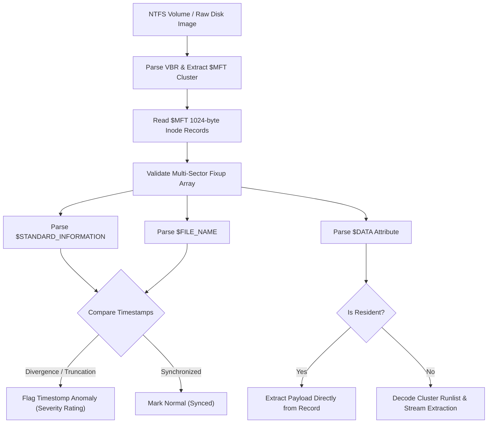
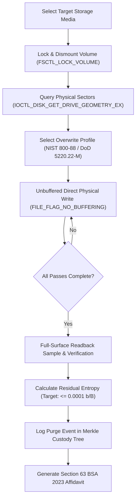
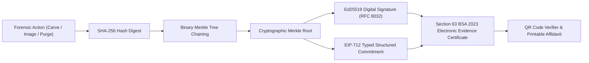

# ForensiX: Integrated Forensic Workstation & Sanitization Platform

[](https://tauri.app/)
[](https://www.rust-lang.org/)
[](https://vitejs.dev/)
[]()
[-blue)]()
[]()

> **Smart India Hackathon (SIH) — Problem Statement PS-26149**  
> *Developed for National Technical Research Organisation (NTRO) / Cyber Defense & Digital Forensics Command*

**ForensiX** is an enterprise-grade, court-admissible digital forensics, bit-stream acquisition, and data sanitization platform. It bridges the gap between commercial forensic suites (e.g., Disk Drill, FTK Imager, EnCase) and statutory national legal standards, providing high-throughput multi-core file carving (420+ format extensions), NTFS Master File Table ($MFT) inode parsing, anti-forensics timestomp anomaly detection, hardware-level media purging, and cryptographic chain-of-custody affidavit generation under Section 63 of the **Bharatiya Sakshya Adhiniyam, 2023** (formerly Section 65B of the Indian Evidence Act).

---

---

## System Architecture

ForensiX employs a multi-tiered, high-throughput systems architecture designed for zero-copy data manipulation, sub-millisecond thread scheduling, and mathematically verifiable forensic integrity.

```mermaid
graph TD
    subgraph Layer1["Layer 1: Presentation & Workstation UI"]
        UI_SHELL["Carbon Shell & Workstation Panels"]
        SECTOR_GRID["140-Block Physical LBA Sector Map"]
        CATEGORY_TRIAGE["Category Triage & Filter Bar (Vector SVGs)"]
        INSPECTOR["Hex, ASCII & Metadata Stream Inspector"]
        TOAST["Carbon Alert & Notification Dispatcher"]
    end

    subgraph Layer2["Layer 2: IPC & Event Channel Bus"]
        TAURI_IPC["Tauri v2 IPC (Zero-Copy Serialization)"]
        EVENT_BUS["Asynchronous Progress & Stream Channel"]
        RATE_LIMITER["UI Dispatch Throttle (10 FPS RAF Buffer)"]
    end

    subgraph Layer3["Layer 3: Forensic Core Engines"]
        CARVER["Parallel File Carver (102 Rules, 428+ Extensions)"]
        SMARTCARVE["SmartCarve (Kullback-Leibler Fragment Stitcher)"]
        MFT_ENGINE["NTFS $MFT Parser & Inode Extractor"]
        TIMESTOMP["Anti-Forensics Anomaly & Timestomp Analyzer"]
        IMAGER["Bit-Stream Imager (1:1 RAW/DD + Fault Map)"]
        SANITIZER["Drive Sanitizer (NIST SP 800-88 / DoD 5220.22-M)"]
        ENTROPY["Shannon Entropy Calculator (0.0 - 8.0 b/B)"]
    end

    subgraph Layer4["Layer 4: Cryptographic Trust & Verification"]
        MERKLE["Binary Merkle Tree Ledger"]
        ED25519["Ed25519 Digital Signatures (RFC 8032)"]
        EIP712["EIP-712 Structured Typed Commitment Digest"]
        PDF_CERT["Section 63 BSA 2023 Statutory Affidavit Engine"]
    end

    subgraph Layer5["Layer 5: OS Kernel & Hardware Direct I/O"]
        WIN_DIRECT["WinAPI Direct I/O (FILE_FLAG_NO_BUFFERING)"]
        MEMMAP["Memory-Mapped Page Cache (memmap2)"]
        IOCTL["DeviceIoControl (Drive Geometry & Partition Layout)"]
        HOTPLUG["Storage Media Event Notification (WMI / Device Events)"]
    end

    UI_SHELL <--> TAURI_IPC
    SECTOR_GRID <--> RATE_LIMITER
    CATEGORY_TRIAGE <--> TAURI_IPC
    INSPECTOR <--> TAURI_IPC
    TOAST <--> RATE_LIMITER

    TAURI_IPC <--> CARVER
    TAURI_IPC <--> MFT_ENGINE
    TAURI_IPC <--> IMAGER
    TAURI_IPC <--> SANITIZER
    EVENT_BUS <--> RATE_LIMITER

    CARVER --> SMARTCARVE
    CARVER --> ENTROPY
    MFT_ENGINE --> TIMESTOMP
    CARVER --> WIN_DIRECT
    CARVER --> MEMMAP
    MFT_ENGINE --> WIN_DIRECT
    IMAGER --> WIN_DIRECT
    SANITIZER --> WIN_DIRECT
    SANITIZER --> IOCTL

    CARVER --> MERKLE
    MFT_ENGINE --> MERKLE
    IMAGER --> MERKLE
    SANITIZER --> MERKLE

    MERKLE --> ED25519
    MERKLE --> EIP712
    ED25519 --> PDF_CERT
    EIP712 --> PDF_CERT
```



### Subsystem Data Flow Pipelines

#### 1. Parallel File Carving & SmartCarve Data Flow Pipeline

```mermaid
flowchart LR
    SRC["Target Drive or Image"] --> READ["32 MB Aligned Read Buffer"]
    READ --> DISPATCH["Rayon Multi-Core Dispatcher"]
    DISPATCH --> MATCH["102 Signatures Magic Matcher"]
    MATCH --> BOUNDARY["Format Boundary Extractor"]
    BOUNDARY --> FRAG_CHECK{"Is Bifurcated?"}
    FRAG_CHECK -- Yes --> KL_BRIDGE["Kullback-Leibler Divergence Matcher"]
    KL_BRIDGE --> STITCH["Bi-Fragment Stitcher"]
    FRAG_CHECK -- No --> CONTIG["Contiguous Stream Assembly"]
    STITCH --> ENTROPY_CALC["Shannon Entropy Calculator"]
    CONTIG --> ENTROPY_CALC
    ENTROPY_CALC --> HASH["SHA-256 Custody Seal"]
    HASH --> MERKLE_LEAF["Append to Merkle Ledger"]
    HASH --> BATCH_QUEUE["UI Batch Queue (100ms Interval)"]
    BATCH_QUEUE --> TABLE["Recovered Artifacts Table"]
```


#### 2. NTFS $MFT Inode & Timestomp Ingestion Pipeline


#### 3. Media Sanitization & Verification Architecture


#### 4. Cryptographic Custody & Legal Certification Architecture


### Concurrency & Memory Management Model
- **Zero-Copy Memory Mapping**: Regular forensic images (`.raw`, `.img`, `.dd`) are mapped into the virtual address space using `memmap2`, leveraging kernel page tables for zero-copy scanning.
- **Direct I/O Sector-Aligned Buffering**: Hardware devices (`\\.\PhysicalDriveX` or `\\.\X:`) are read using `FILE_FLAG_NO_BUFFERING | FILE_FLAG_SEQUENTIAL_SCAN` with 4096-byte boundary-aligned 32 MB heap buffers, bypassing Windows filesystem cache overhead.
- **Work-Stealing Concurrency**: Chunk processing is managed by `rayon`, dynamically distributing 4 MB sector blocks across all available CPU threads without lock contention.
- **Decoupled Asynchronous UI Streaming**: Progress ticks, sector head movements, and discovered artifacts are dispatched across Tauri IPC event channels throttled to 10 FPS with a 100ms batch flush queue, ensuring 0% UI freeze even when parsing high-density cluster drives.

---

## Key Features

### 1. Advanced Multi-Sector File Carver (Disk Drill 400+ Parity)
- **428+ Supported File Formats**: 102 signature rule descriptors covering all major file classes:
  - **Images & RAW**: CR2, CR3, NEF, ARW, DNG, RAF, RW2, HEIC, AVIF, JPEG, PNG, WebP, TIFF, PSD, SVG, ICO, BMP.
  - **Documents**: PDF, Microsoft Office OOXML (DOCX, XLSX, PPTX), Legacy OLE2 (DOC, XLS, PPT, MSG), RTF, EPUB, ODF.
  - **Archives & Containers**: ZIP, 7z, RAR, Zstandard, GZIP, BZIP2, XZ, TAR, ISO, DMG, VHD, VMDK.
  - **Audio & Video**: MP4, MKV, AVI, MOV, WMV, FLV, WebM, MP3, FLAC, WAV, AAC, OGG, M4A, MIDI.
  - **Databases & Virtual Machines**: SQLite3, ESE/EDB (Exchange/Active Directory), Registry Hives, VMDK, VHD.
  - **Executables & Binaries**: PE (EXE, DLL, SYS), ELF, Mach-O, Java Class/JAR, WebAssembly.
  - **Cryptographic & Key Material**: PEM, DER, PFX, JWT, EVTX, PCAP/PCAPNG, Bitcoin Wallets.
- **SmartCarve Bi-Fragment Stitched Reassembly**: Reconnects bifurcated / fragmented cluster runs using Kullback-Leibler divergence continuity matching across unallocated clusters.
- **Direct I/O Hardware Reads**: Uses `FILE_FLAG_NO_BUFFERING` and `FILE_FLAG_SEQUENTIAL_SCAN` with aligned 32 MB chunk buffers to bypass the Windows cache manager for maximum raw disk throughput.
- **Shannon Entropy Engine**: Computes real-time byte entropy ($0.0 - 8.0 \text{ bits/byte}$) to differentiate plain text, compiled code, structured containers, and high-entropy encrypted blobs.

### 2. NTFS $MFT Inode Ingestion & Anti-Forensics Analysis
- Direct parsing of `$MFT` record headers, `$STANDARD_INFORMATION`, and `$FILE_NAME` attributes.
- **Timestomping Detection**: Cross-references `$SI` and `$FN` timestamps; automatically flags nanosecond truncation, retro-dated modification times, and metadata tampering with severity ratings.
- **Resident & Runlist Extraction**: Extracts resident payload bytes directly from `$DATA` attributes or resolves non-resident cluster runlists for immediate file recovery.

### 3. Bit-Stream Forensic Disk Imager (1:1 Acquisition)
- Court-admissible bit-stream raw acquisition (`.raw` / `.dd`).
- Real-time forensic SHA-256 and Blake3 custody hashing during acquisition.
- Bad sector fault mapping: automatically skips bad clusters with zero-padding to prevent forensic tool lockup while preserving 1:1 physical sector offsets.

### 4. Storage Sanitization & Media Purge Engine
- **Certified Sanitization Standards**:
  - **NIST SP 800-88 Rev 1 (Clear / Purge)**: Single-pass zero or pseudorandom overwrite with post-wipe verification.
  - **DoD 5220.22-M (ECE)**: 3-pass overwrite (Zeroes $\rightarrow$ Complementary $\rightarrow$ Random).
  - **Gutmann Algorithm**: 35-pass magnetic and electronic media erasure.
  - **BSI VSITR** (German Standard): 7-pass alternating bit-pattern overwrite.
  - **US Army AR 380-19**: 3-pass military specification.
- **Direct Physical I/O**: Direct low-level drive writes bypassing OS write caches for zero residual cluster data.
- **Residual Entropy Verification**: Analyzes read-back sectors across the entire media surface; proves residual entropy is $\le 0.0001 \text{ b/B}$ (for clear) or $\ge 7.999 \text{ b/B}$ (for purge).

### 5. Legal Chain of Custody & Court Certificates
- **Section 63 BSA 2023 Statutory Affidavit**: Auto-generates court-admissible electronic evidence certificates conforming to Section 63 of the Bharatiya Sakshya Adhiniyam, 2023.
- **Cryptographic Merkle Tree**: Chained ledger of all acquisition, carving, extraction, and wipe events with rolling Merkle root hashes.
- **Ed25519 Digital Signatures**: Every forensic report is signed with an examiner keypair conforming to RFC 8032.
- **EIP-712 Structured Commitments**: Blockchain-ready anchor digests for immutable tamper verification.
- **PDF Affidavit Generation**: Printable legal affidavit with forensic metadata, hash manifests, and verification QR codes.

### 6. IBM Carbon Design System Workstation
- Clean, distraction-free desktop interface following the enterprise IBM Carbon Design System.
- Dynamic 140-block interactive physical sector allocation map with real-time head tracking.
- Zero-emoji policy: vector SVG glyphs for all categories, notifications, and modal controls.
- Asynchronous UI throttling: RequestAnimationFrame and batch queue streaming prevent DOM lockups during 100,000+ cluster sweeps.

---

## Technical Stack

| Layer | Technology |
| :--- | :--- |
| **Desktop Framework** | [Tauri v2](https://v2.tauri.app/) (Rust + WebView2) |
| **Backend Language** | Rust 2021 Edition (`opt-level = 3` for crypto & carver hot path) |
| **Concurrency** | [Rayon](https://crates.io/crates/rayon) (work-stealing multi-core chunk scheduling) |
| **Direct I/O** | WinAPI (`ioapiset`, `winioctl`, `handleapi`, `fileapi`, `wincrypt`) |
| **Zero-Copy Memory** | [memmap2](https://crates.io/crates/memmap2) (OS page cache memory-mapped files) |
| **Cryptography** | `sha2` (SHA-256), `ed25519-dalek` (Digital signatures), `tiny-keccak` (Keccak-256 / EIP-712) |
| **PDF Generation** | `printpdf` (Vector forensic affidavits) |
| **Frontend Framework** | Vanilla ES Modules + HTML5 + CSS3 (Zero heavy UI runtime overhead) |
| **Design Language** | IBM Carbon Design System (Tokens, Spacing, Typography, 16px Vector Glyphs) |
| **Build System** | [Vite 8](https://vitejs.dev/) + Cargo |

---

## Project Structure

```
forensix/
├── src/                          # Frontend Application (Vite + Carbon UI)
│   ├── index.html                # Workstation shell & modal dialogs
│   ├── main.js                   # Application state, router, IPC listeners, UI controllers
│   └── style.css                 # IBM Carbon design tokens, themes, layouts, sector map
├── src-tauri/                    # Backend Core (Rust 2021)
│   ├── Cargo.toml                # Crate manifest, dependency profile overrides
│   ├── tauri.conf.json           # Tauri v2 application configuration & permissions
│   ├── icons/                    # Workstation icon assets
│   └── src/
│       ├── main.rs               # Application entry point & Tauri command registration
│       ├── lib.rs                # Library exports
│       ├── error.rs              # Typed forensic domain errors
│       ├── adversarial.rs        # Anti-forensics analyzer (timestomps, ADS, entropy)
│       ├── carver/               # Parallel file carving & reassembly engine
│       │   ├── mod.rs            # Carver coordinator & session manager
│       │   ├── scanner.rs        # Direct I/O unbuffered drive reader & Rayon chunk dispatcher
│       │   ├── signatures.rs     # 102 forensic signatures (428+ file extensions)
│       │   ├── extractor.rs      # Format boundary parser (JPEG, PNG, PDF, ZIP, RIFF, etc.)
│       │   └── stitcher.rs       # SmartCarve Kullback-Leibler fragment stitching
│       ├── device/               # Storage media discovery & geometry
│       │   ├── mod.rs            # Cross-platform drive enumerator
│       │   └── windows.rs        # Win32 DeviceIoControl, volume geometry, drive hotplug
│       ├── eraser/               # Data sanitization engine
│       │   ├── mod.rs            # Eraser coordinator & standard runner
│       │   ├── standards.rs      # NIST SP 800-88, DoD 5220.22-M, Gutmann passes
│       │   └── shredder.rs       # Inode metadata scrubbing & multi-pass file shredder
│       ├── forensics/            # Filesystem ingestion
│       │   ├── mod.rs            # Filesystem driver abstraction
│       │   └── ntfs.rs           # Master File Table ($MFT) record & attribute parser
│       └── report/               # Audit ledger & statutory certification
│           ├── mod.rs            # Merkle tree anchor & chain verification
│           ├── pdf_cert.rs       # Section 63 BSA 2023 legal affidavit PDF generator
│           └── cert.rs           # Ed25519 signature & EIP-712 commitment digests
└── package.json                  # Frontend dependencies & npm scripts
```

---

## Installation & Prerequisites

### System Requirements
- **Operating System**: Windows 10 / 11 (64-bit) *(Required for Win32 direct hardware I/O and unbuffered volume querying)*.
- **Node.js**: v18.0 or newer.
- **Rust**: Rust 1.78+ with `cargo` installed via [rustup.rs](https://rustup.rs/).
- **C++ Build Tools**: Visual Studio 2022 C++ Build Tools (MSVC toolchain).
- **Administrative Privileges**: Administrative rights are required for raw physical drive access (`\\.\PhysicalDriveX` or `\\.\X:`).

---

## Quick Start

### 1. Clone the Repository
```bash
git clone https://github.com/your-org/forensix.git
cd forensix
```

### 2. Install Frontend Dependencies
```bash
npm install
```

### 3. Run in Development Mode
Launch the application with live reload for both Rust and frontend code:
```bash
npm run dev
```

> **Note**: In development mode, heavy computational dependencies (`rayon`, `memmap2`, `sha2`, `hex`, `byteorder`) automatically compile with `opt-level = 3` optimizations via Cargo profile overrides to ensure fast scan speeds during testing.

### 4. Build Production Executable
To produce an optimized, court-deployable release bundle:
```bash
npm run build
```
The compiled standalone executable and installer will be located in:
```
src-tauri/target/release/forensix.exe
src-tauri/target/release/bundle/msi/forensix_0.1.0_x64_en-US.msi
```

---

## Operation Guide

### 1. File Recovery & Carving
1. Launch ForensiX with **Run as Administrator**.
2. Navigate to **File Recovery** in the navigation bar.
3. Select your target physical disk, volume letter (e.g., `\\.\E:`), or forensic disk image (`.img`, `.raw`, `.dd`).
4. Click **Start Deep Carve**.
5. Watch the real-time **Sector Allocation Map** track active LBA read heads and highlight carved clusters.
6. Use the **Category Triage Filter** (Pictures, Video, Audio, Documents, Databases, Archives, Executables, Keys) or search bar to inspect artifacts.
7. Select artifacts and click **Recover Selected Files** to export with integrity checks.

### 2. $MFT Inode Scanning & Timestomp Triage
1. On the File Recovery page, switch the mode tab to **$MFT Inode Ingestion**.
2. Select an NTFS volume or image and click **Scan $MFT Inodes**.
3. Check the **Timestomp Alerts** column to review files where `$STANDARD_INFORMATION` and `$FILE_NAME` timestamps diverge.
4. Extract deleted resident or non-resident files directly from inode cluster runs.

### 3. Certified Drive Sanitization
1. Navigate to **Drive Sanitizer**.
2. Select the target media from the detected hardware dropdown.
3. Choose the compliance standard (e.g., **NIST SP 800-88 Rev 1 Clear/Purge** or **DoD 5220.22-M**).
4. Initiate the sanitization cycle and monitor the pass telemetry and sector map.
5. Upon completion, review the **Residual Entropy Verification** report.
6. Click **Generate Legal Certificate** to review and print the signed Section 63 BSA 2023 affidavit.

---

## Regulatory Compliance & Statutory References

| Standard / Law | Authority | Implementation in ForensiX |
| :--- | :--- | :--- |
| **Section 63 BSA 2023** | Republic of India (Act No. 47 of 2023) | Digital signature, Merkle root, write-block certification, PDF affidavit. |
| **NIST SP 800-88 Rev 1** | National Institute of Standards & Technology (USA) | Media sanitization (Clear & Purge), post-wipe bit-level entropy audit. |
| **DoD 5220.22-M** | United States Department of Defense | 3-pass overwrite pattern verification. |
| **RFC 8032 (Ed25519)** | Internet Engineering Task Force (IETF) | Cryptographic digital signatures on all forensic case exports. |
| **EIP-712** | Ethereum Improvement Proposals | Structured typed data hashing for blockchain anchor verification. |

---

## Security & Forensic Integrity Policy

- **Strict Write-Blocking**: Drive imaging and carving routines open storage device handles with read-only flags (`GENERIC_READ`, `FILE_SHARE_READ | FILE_SHARE_WRITE`).
- **Cryptographic Chain of Custody**: Every carved artifact is hashed with SHA-256 immediately upon memory extraction; hashes are recorded in the internal immutable Merkle tree.
- **Air-Gapped Operation**: ForensiX requires zero internet access for core operations. All signature matching, entropy calculation, MFT parsing, and certificate generation occur completely offline.

---

## License & Disclaimer

This software is developed for the **Smart India Hackathon (SIH)** under problem statement **PS-26149** for law enforcement, intelligence, and forensic defense applications.

*Disclaimer: Ensure proper authorization and legal custody mandates prior to acquiring, imaging, or sanitizing digital evidence media.*
